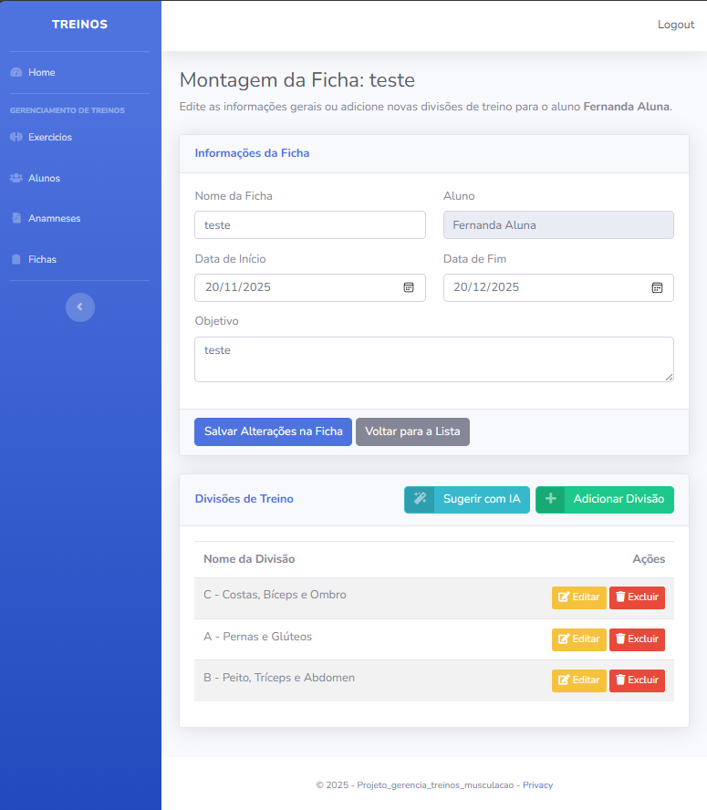
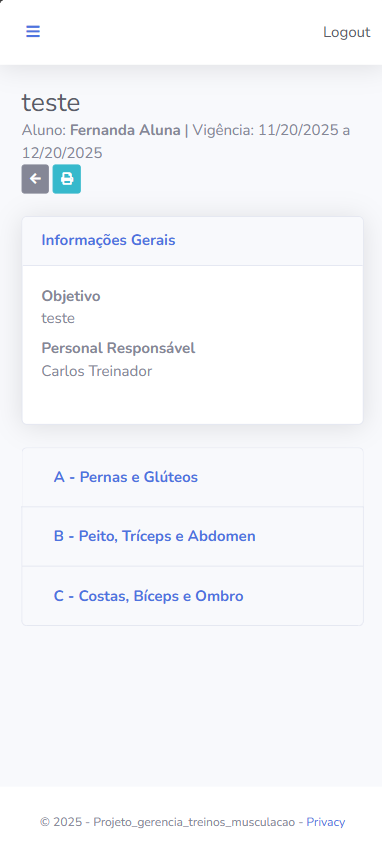

# 🏋️‍♂️ Sistema de Gestão de Treinos com IA

> **Trabalho de Conclusão de Curso (TCC)** focado em otimizar a rotina de Personal Trainers através da tecnologia e Inteligência Artificial.

## 📄 Sobre o Projeto

Este sistema é uma aplicação web robusta desenvolvida para auxiliar Personal Trainers na gestão de alunos, anamneses e, principalmente, na prescrição de treinos. 

O grande diferencial do projeto é a utilização da **IA Generativa (Google Gemini)**. O sistema analisa a anamnese do aluno e, com um clique, sugere uma ficha de treino completa e personalizada, utilizando apenas os exercícios disponíveis no catálogo do profissional.

## 📸 Screenshots

### 1. Dashboard do Personal Trainer
Uma visão geral do fluxo de trabalho, com indicadores Kanban para alunos sem ficha e treinos vencendo.

### 2. Montagem de Ficha com IA
O Personal pode editar manualmente ou solicitar sugestões à IA.

### 3. Visão do Aluno (Mobile)
Interface responsiva e limpa para o aluno acompanhar seu treino na academia.

## 🚀 Funcionalidades Principais

- **Gestão Completa (CRUD):** Alunos, Exercícios, Anamneses e Fichas.
- **Sugestão de Treino via IA:** Integração com API do Google Gemini para criar treinos baseados no perfil do aluno.
- **Controle de Acesso (RBAC):** Perfis distintos para Admin, Personal e Aluno via ASP.NET Identity.
- **Design Responsivo:** Tabelas inteligentes (DataTables) que se adaptam a celulares e desktops.
## 🛠️ Tecnologias e Arquitetura

O projeto foi desenvolvido seguindo utilizando a arquitetura **MVC** com separação de responsabilidades utilizando services.

* **Back-end:** C# .NET 8, ASP.NET Core MVC.
* **Banco de Dados:** SQL Server (Azure SQL), Entity Framework Core (Code-First).
* **Front-end:** Razor Views, Bootstrap 5 (SB Admin 2), JavaScript, jQuery DataTables.
* **IA:** Google Gemini API.
* **Segurança:** ASP.NET Core Identity.
